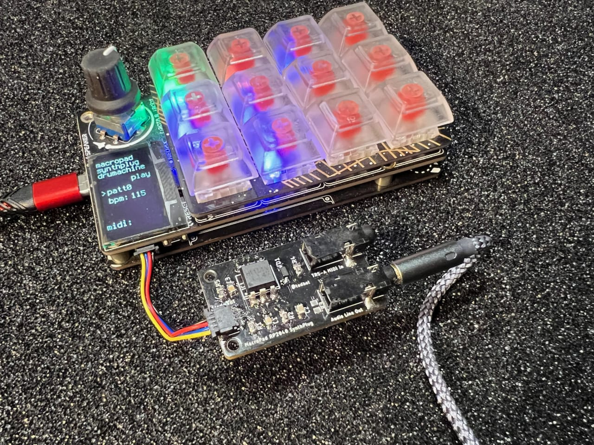
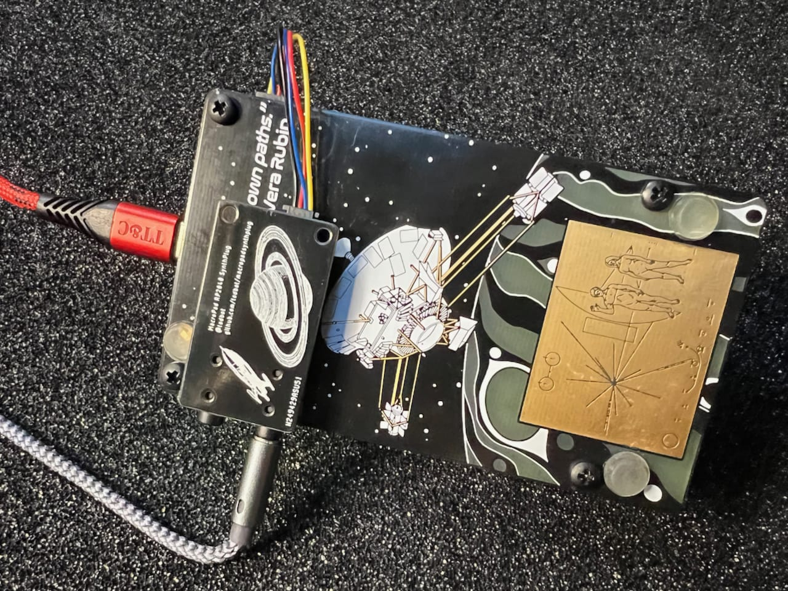

# MacroPadSynthPlug!

abuse MacroPad RP2040's StemmaQT port by turning it into Audio Out + MIDI In

Demo video on Youtube:

## What is this?

The [Adafruit MacroPad RP2040](https://learn.adafruit.com/adafruit-macropad-rp2040/overview)
is really fun and could be a great musical instrument,
with its 12 keys, rotary encoder, OLED display, RP2040 chip, and 8MB of flash storage.

If it only had a way to get MIDI into it and Audio out of it!
Well now you can, with MacroPadSynthPlug!

MacroPadSynthPlug is a small board that plugs into the StemmaQT port (but is not I2C!)
and gives you [TRS-A MIDI In](https://minimidi.world/) and Audio line out.

The MacroPad RP2040 can now be a stand-alone MIDI synth!

Examples in this repo show how to do this in both CircuitPython and Arduino.

## How?

The [Raspberry Pi RP2040 chip](https://www.raspberrypi.com/documentation/microcontrollers/rp2040.html)
on the MacroPad RP2040 is amazingly configurable.

Normally a port like the StemmaQT I2C port would only be usable as an I2C bus, or maybe as GPIO pins.

But with the RP2040, those two StemmaQT pins, can be:

- SDA - GP20 - UART1 TX - PWM2B
- SCL - GP21 - UART1 RX - PWM2A

This means we could use the StemmaQT port for all sorts of musical things, like:

- MIDI In / Out!
- Stereo PWM audio out!
- MIDI In / Audio Out  (Hey this is what MacroPadSynthPlug does)

To get audio out, all we need is a small PWM filtering circuit.
To get MIDI in, a small optoisolator circuit is needed.  MacroPadSynthPlug is just this.

This is sort of an "abuse" of the StemmaQT port, as it's meant only for I2C devices.
But it's safe, will not damage other StemmaQT devices,
but it does mean you "lose" the StemmaQT port for it's normal use.

## Why?

Seems like fun?  I have built many RP2040-based little hardware synths, like:
- [PicoStepSeq](https://github.com/todbot/picostepseq)
- [picotouchsynth](https://github.com/todbot/picotouchsynth)
- [plinkykeeb](https://github.com/todbot/plinkykeeb)
- [seeknobs](https://github.com/todbot/seeknobs)

and wanted the MacroPad RP2040 to join in the fun.

## Are these for sale?

Not yet!  But perhaps soon!

## Action shots

