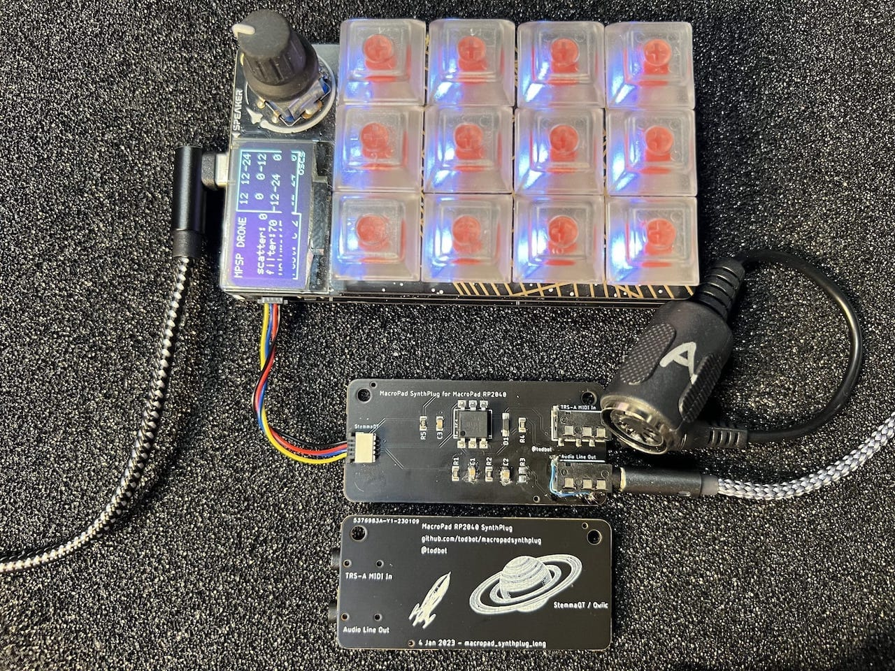

# MacroPadSynthPlug!

Turn MacroPad RP2040's StemmaQT port into Audio Out + MIDI In

Demo video on Youtube:

## What is this?

The [Adafruit MacroPad RP2040](https://learn.adafruit.com/adafruit-macropad-rp2040/overview)
is really fun and could be a great musical instrument,
with its 12 keys, rotary encoder, OLED display, RP2040 chip, and 8MB of flash storage.

If it only had a way to get MIDI into it and Audio out of it!
Well now you can, with MacroPadSynthPlug!

MacroPadSynthPlug is a small board that plugs into a StemmaQT / Qwiic port
and gives you [TRS-A MIDI In](https://minimidi.world/) and Audio line out.
It's not I2C, but is using those pins. 

The MacroPad RP2040 can now be a stand-alone MIDI synth!

Examples provided for both [CircuitPython](https://circuitpython.org/) and [Arduino](https://arduino-pico.readthedocs.io/en/latest/):

* __drum_machine__ - CircuitPython-based drum sequencer ([demo1](https://youtu.be/jMKC_18M17U),[demo2](https://youtu.be/bJwyUjxc6VM) )
* __dronesynth__ - Arduino Mozzi 12-oscillator drone synth ([demo](https://youtu.be/kLwP-vyvtLM))
* __remixer__ - CircuitPython-based song remixer ([source](https://github.com/todbot/macropadsynthplug/tree/main/circuitpython/remixer))
* __monosynth1__ - Arduino Mozzi 2-oscillator bass monosynth w/ resonant low-pass filter ([source](https://github.com/todbot/macropadsynthplug/tree/main/arduino/monosynth1))

## How?

The [Raspberry Pi RP2040 chip](https://www.raspberrypi.com/documentation/microcontrollers/rp2040.html)
on the MacroPad RP2040 is amazingly configurable.

Normally a port like the StemmaQT I2C port would only be usable as an I2C bus. 
With the MacroPad RP2040, the two StemmaQT pins have the possible functionality:

* MacroPad RP2040 StemmaQT SDA -- GP20 - UART1 TX - PWM2B
* MacroPad RP2040 StemmaQT SCL -- GP21 - UART1 RX - PWM2A

MacroPadSynthPlug is a simple combination of two circuits:

* For MIDI in: StemmaQT SCL has an optoisolator circuit and TRS MIDI In jack

* For PWM Audio Out: StemmaQT SDA has a PWM filtering circuit and Audio Out jack

This is an "abuse" of the StemmaQT port, as it's meant only for I2C devices.
But it's safe, will not damage other StemmaQT devices,
but it does mean you "lose" the StemmaQT port for its normal use with I2C.

## Does this work for other boards with StemmaQT?

Short answer: Yes, with caveats

* For audio out, any board that can do PWM on StemmaQT SDA can use the
  Audio Out side of MacroPadSynthPlug

* For MIDI In, any boards that can do UART In on StemmaQT SCL can do TRS MIDI input. 
  A "software serial" for TRS MIDI In may work, and of course USB MIDI In will 
  always work

This makes this list of boards this works with kinda small. 

### Tested boards:

* [Adafruit MacroPad RP2040](https://learn.adafruit.com/adafruit-macropad-rp2040)

* [Adadfruit KB2040 "Keeboar"](https://learn.adafruit.com/adafruit-kb2040)

* [Adafruit QTPy RP2040](https://learn.adafruit.com/adafruit-qt-py-2040) 
  * with a PIO-based UART libary like [`SerialPIO`](https://arduino-pico.readthedocs.io/en/latest/piouart.html) or [`adafruit_pio_uart`](https://github.com/adafruit/Adafruit_CircuitPython_PIO_UART)
  * as an example, see [qtpy_mpsp_synth](./circuitpython/qtpy_mpsp_synth/code.py)

* Raspberry Pi Pico or Pico 2 
  * with a [StemmaQT](https://www.adafruit.com/product/4209) / [Qwiic](https://www.sparkfun.com/flexible-qwiic-cable-breadboard-jumper-4-pin.html) breadboard jumper cable

## Why?

Seems like fun?  I have built many little hardware synths, like:

- [PicoStepSeq](https://github.com/todbot/picostepseq)
- [picotouchsynth](https://github.com/todbot/picotouchsynth)
- [plinkykeeb](https://github.com/todbot/plinkykeeb)
- [seeknobs](https://github.com/todbot/seeknobs)

and wanted the MacroPad RP2040 to join in the fun.

## Are these for sale?

Yes! [Get one now at Tindie!](https://www.tindie.com/products/todbot/macropadsynthplug-turn-rp2040-into-a-synth/)

## Action shots

